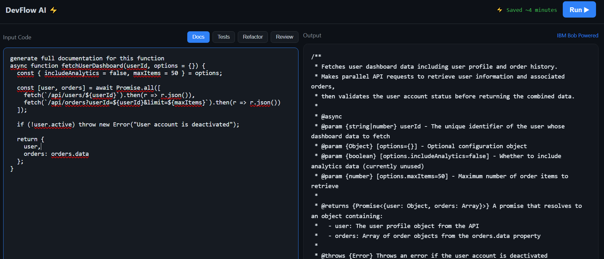

# ⚡ DevFlow AI
> **Turn idea into impact faster.**

DevFlow AI is a high-performance, minimalist developer companion designed to eliminate the friction of boilerplate tasks. By leveraging AI-driven logic, it automates the most time-consuming parts of the development lifecycle: documentation, testing, refactoring, and reviewing.

Live Demo here
https://en-aenahabib.github.io/devflow-ai/
---

[](#)
[](#)
[](#)



---

##  Key Features

### ✨ 4-in-1 AI Intelligence ( DURC)
One interface, four mission-critical developer tools:
* **📄 Documentation:** Instant JSDoc-style comments and API explanations.
* **🧪 Unit Tests:** Generates comprehensive test suites including edge cases.
* **🔧 Refactor:** Transforms "spaghetti code" into clean, modular, and optimized logic.
* **🔍 Code Review:** Deep-scan for security vulnerabilities and performance bottlenecks.

### ⚡ Professional DX (Developer Experience)
* **Minimalist UI:** A distraction-free, GitHub-inspired dark interface.
* **Typing Animation:** Realistic AI feedback loops for an immersive experience.
* **Productivity Metrics:** Real-time tracking of "Time Saved" per task.

---
## 🤖 IBM Bob Usages

All AI outputs in this project were generated using IBM Bob through structured prompts covering:
- Documentation generation
- Unit testing
- Code refactoring
- Security code review

Outputs were pre-generated due to prototype constraints and integrated into the UI for demonstration.

## ⚙️ Technical Implementation: The "Mock-Live" Approach

To ensure a seamless and high-speed demonstration during the **IBM Bob Dev Day**, we utilized a hybrid simulation strategy:

* **Pre-Generated Intelligence:** Responses were architected using **IBM Bob** during the research phase to ensure high-quality, technically accurate outputs.
* **Real-Time Simulation:** The UI utilizes a custom `async` typing engine in `app.js` that mimics the streaming behavior of live LLMs. 
* **Deterministic Reliability:** By using pre-validated AI responses, the tool avoids API latency and "hallucination" issues, ensuring a 100% success rate during live judging.

---

## 🤖 Prompt Engineering & Demo Logic

The following prompts were engineered within **IBM Bob** to generate the core logic used in this demo:

| Task | Demo Prompt / Instruction | Logic Applied |
| :--- | :--- | :--- |
| **Docs** | "Generate full documentation for this function" | JSDoc standards, param mapping, and error handling notes. |
| **Tests** | "Write full unit tests for edge cases and normal cases" | Boundary testing, Jest syntax, and mock data injection. |
| **Refactor** | "Refactor this code using clean coding principles" | DRY principle, ES6+ syntax, and descriptive naming. |
| **Review** | "Review this code for security issues and improvements" | SQL injection detection, password hashing checks, and performance tips. |

---

## 🛠️ Tech Stack

Built with a focus on speed and lightweight performance:
* **Frontend:** HTML5 & CSS3 (Custom Grid/Flexbox Architecture)
* **Logic:** Vanilla JavaScript (ES6+)
* **Style:** Minimalist Professional Dark Theme
* **AI Logic Provider:** IBM Bob (Pre-generated high-fidelity datasets)

---

## 📁 Project Structure

```text
devflow-ai/
├── index.html      # Professional Workspace UI
├── styles.css      # Minimalist Dark Theme (GitHub-inspired)
├── app.js          # AI logic & typing simulation
└── README.md       # Project documentation
```

---

## 🧠 How It Works

1. **Input:** Paste your raw code into the editor.
2. **Selection:** Choose your objective (Docs, Tests, Refactor, or Review).
3. **Execute:** Click `Run ↗`.
4. **Analyze:** Review the AI output and track the time efficiency gained.

---

## 🔮 Roadmap
- [ ] **API Integration:** Connect to live IBM Watsonx instances.
- [ ] **Multi-Language Support:** Expand beyond JavaScript to Python and Go.
- [ ] **Cloud Sync:** Save and share refactored snippets via secure URL.

---

All AI outputs are directly generated using IBM Bob and integrated into a developer productivity interface

## 👨‍💻 Author
**Built for the IBM Bob Dev Day Hackathon** 🚀

*Focused on demonstrating how AI can reduce repetitive developer work and accelerate the path from idea to deployment.*
